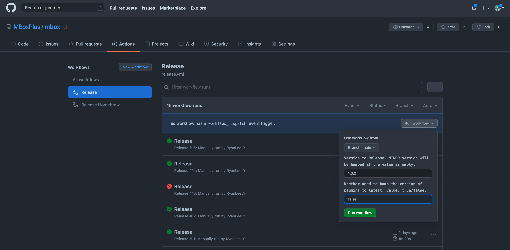
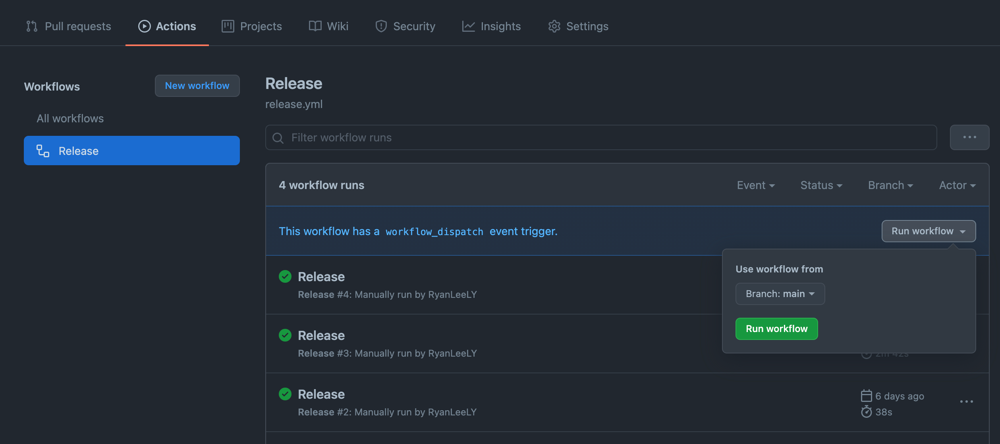

# Release

## Release MBox

- Change the plugins' version in `mbox-package.yml` file.

- Open `GitHub Action` page on the repo `MBoxPlus/mbox`.

- Choose branch 'main' and input the `Semantic version` to release.

- Click the button `Run workflow`.

## Release Plugin

- Open `GitHub Action` page on the plugin repo `MBoxPlus/mbox-xxx`.

- Choose branch 'main'.

- Click the button `Run workflow`.

