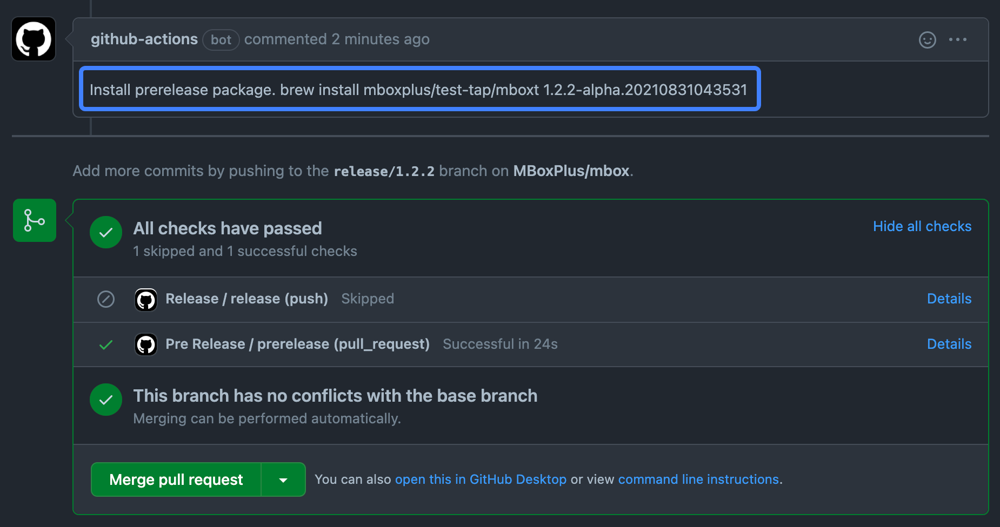

# Release

## Release MBox

- Checkout a new branch named `release/[VERSION_TO_RELEASE]` like `release/1.0.1`.

- `bundle install`

- `bundle exec rake bump_plugin` to bump all plugins' version.

- `bundle exec rake bump\['1.0.1'\]` to bump version.

- Open a pull request on [GitHub](https://github.com/MBoxPlus/mbox).

- You can install a prerelease package after the pipeline jobs done.

- Click `Merge Pull Request` to trigger publishing.

## Release Plugin

- Open `GitHub Action` page on the plugin repo `MBoxPlus/mbox-xxx`.

- Choose branch 'main'.

- Click the button `Run workflow`.

